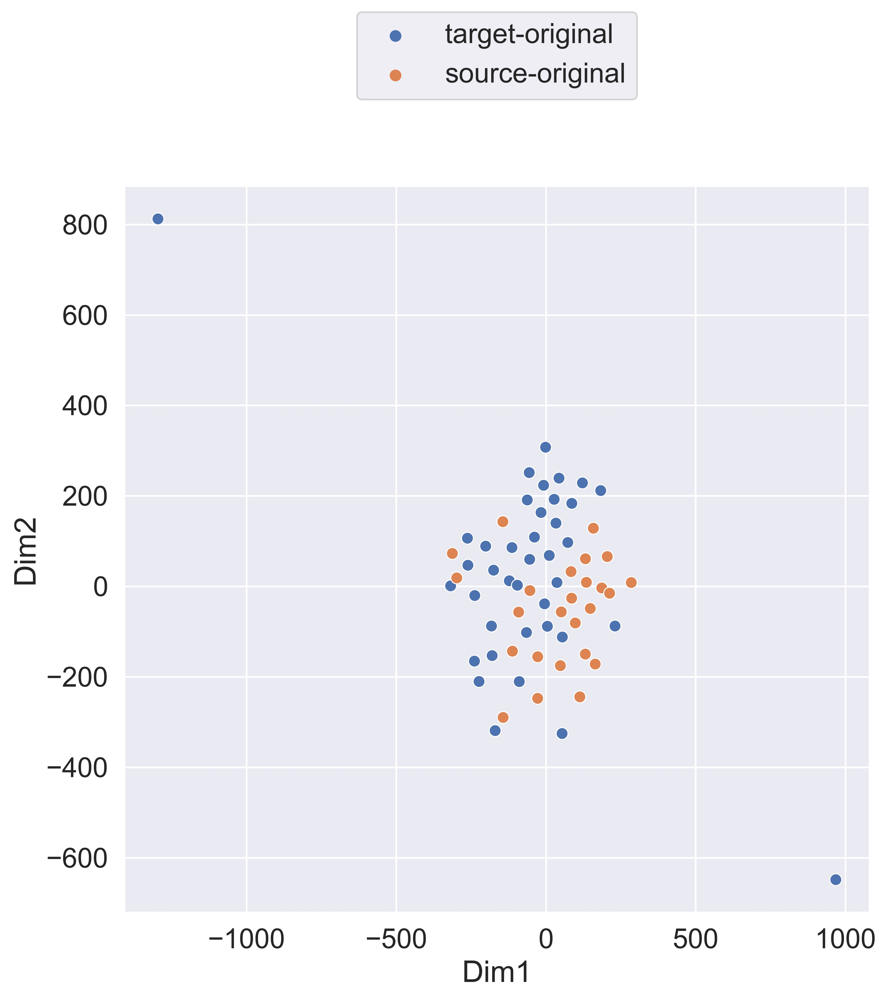

# TransQE
## Author Response

### Detailed reuslts of Figure 6:

For word-level taget word tagging task:

| Bitext Type | 1:0    | 1:10   | 1:20   | 1:50   | 1:80   |
|-------------|--------|--------|--------|--------|--------|
| S-O         | 0.4444 | 0.4811 | 0.4921 | 0.5121 | 0.5188 |
| MIX         | 0.4444 | 0.4691 | 0.4813 | 0.4969 | 0.5059 |
| T-O         | 0.4444 | 0.4602 | 0.468  | 0.4815 | 0.4941 |

For sentence-level HTER:

| Bitext Type | 1:0    | 1:10   | 1:20   | 1:50   | 1:80   |
|-------------|--------|--------|--------|--------|--------|
| S-O         | 0.6225 | 0.6517 | 0.6553 | 0.6685 | 0.6766 |
| MIX         | 0.6225 | 0.6406 | 0.6492 | 0.6602 | 0.6641 |
| T-O         | 0.6225 | 0.6281 | 0.6293  | 0.642 | 0.6525 |

### Additional results
We did experiments on some specific parallel corpora to further investigate the influece of bitext direction, which includes:

**WikiMatrix**

For word-level taget word tagging task:

| Bitext Type | 1:0    | 1:50   | 
|-------------|--------|--------|
| S-O         | 0.4444 | 0.5132 | 
| MIX         | 0.4444 | 0.4881 | 
| T-O         | 0.4444 | 0.4573 | 

For sentence-level HTER:

| Bitext Type | 1:0    | 1:50   | 
|-------------|--------|--------|
| S-O         | 0.6225 | 0.6689 | 
| MIX         | 0.6225 | 0.6507 | 
| T-O         | 0.6225 | 0.6314 | 

The results show a larger gap between S-O and MIX, S-O and T-O, since WikiMatrix may have larger proportion of sentence pairs with **explicit translation direction** than ramdomly sampled parallel data, i.e. sentences from the Bible (English-original), classical Chinese (Chinese-original). The Chinese-original sentences are far from real En-Zh QE data, and using T-O for data augmentation contributes little to QE performance.

**UN parallel corpus**

For word-level taget word tagging task:

| Bitext Type | 1:0    | 1:50   | 
|-------------|--------|--------|
| S-O         | 0.4444 | 0.4832 | 
| MIX         | 0.4444 | 0.4856 | 
| T-O         | 0.4444 | 0.4876 | 

For sentence-level HTER:

| Bitext Type | 1:0    | 1:50   | 
|-------------|--------|--------|
| S-O         | 0.6225 | 0.6547 | 
| MIX         | 0.6225 | 0.6589 | 
| T-O         | 0.6225 | 0.6499 | 

We cannot observe much difference between three types of bitext, since UN-parallel corpus is composed of undirectional data (official UN documents aligned across languages).

However, aligned bietxt like UN-parallel is rare considering the total amount of parallel data used in QE data augmentation. Thus, we still suggest to differentiate translation direction in QE data augmentation.

### Visualization of target-side sentence embeds 

Following reviwer#2's advice, we randomly sample 100 sentence pairs from WiKiMatrix corpus and **manually check** the translation direction. To ensure reliability of our annotation, we only annotate sentence pairs of explicit direction, for which we can find the source. We found **28** source original sentence pairs, part of them are from the Bible, or the Koran. We found **36** target-original sentence pairs, **34** of them are classical Chinese text, and **26** of them are excerpts from "The Romance of the Three Kingdoms", a novel of the Ming Dynasty in China. We leave rest of the sentence pair as "no explicit translation direction" and do not visiualize their target-side sentence embedding.

The image shows a visualization of target-side sentence embedding (embedding of \[CLS\] token) produced by a **unfinetuned** BERT model. We can still differentiate sentence pairs with explicit s-o or t-o translation direction.
